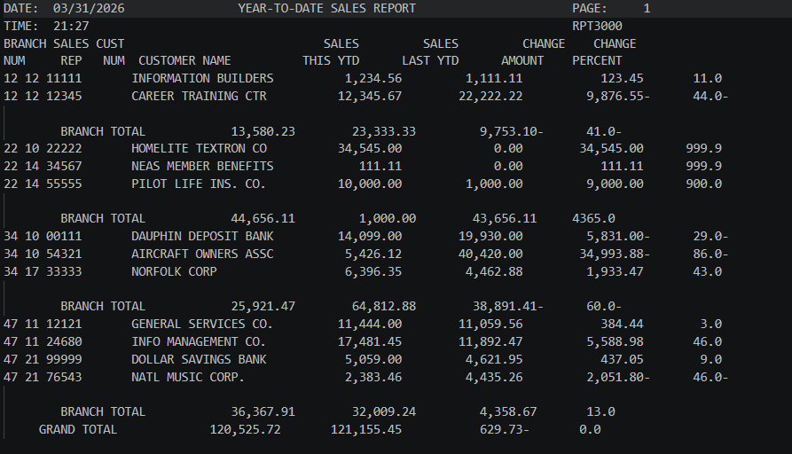

# COBOL RPT3000 – Sales Report Program

## 📘 Introduction
The RPT3000 is a sophisticated COBOL-based reporting engine designed to analyze year-over-year sales performance. By processing historical and current transaction data, the program provides deep insights into sales trends, growth metrics, and organizational performance across multiple tiers.

---

## 📑 Table of Contents
- [👥 Authors](#-authors)
- [📌 What does it do?](#-what-does-it-do)
- [🖥️ Output Example](#️-output-example)
- [🧠 COBOL Concepts Used](#-cobol-concepts-used)

---

## 👥 Authors
  
👨‍💻 **Jacob Schamp**

- **Jacob Schamp GitHub Profile**: [jascha10](https://github.com/jascha10)
  
- **Email**: [jascha10@wsc.edu]

---

## 📌 What does it do?

For each run, the program:

1. Reads customer sales data from an input file  
2. Calculates:
   - Sales difference (This Year - Last Year)
   - Percentage change in sales  
3. Outputs a formatted report including:
   - Branch Number  
   - Sales Representative Number  
   - Customer Number  
   - Customer Name  
   - Sales (This Year)  
   - Sales (Last Year)  
   - Change in Amount  
   - Change in Percentage  
4. Groups and summarizes data at multiple levels:
   - Sales Representative totals  
   - Branch totals  
   - Grand totals  

---

## 🖥️ Output Example

RPT3000:

---

## 🧠 COBOL Concepts Used

### 1. Control Break Logic
I designed the program to detect changes in the Branch or Sales Representative numbers to trigger totals. Because the input file is sorted, I can compare the current record to the previous one to decide when a group has ended.

When a change occurs: I print the sub-totals for that group, reset the accumulators to zero, and update the "old" comparison fields.

Example from my code: WHEN CM-BRANCH-NUMBER > OLD-BRANCH-NUMBER

### 2. Accumulators (Totals)
I use specific variables to "roll up" sales data from the individual customer level all the way to the final grand total.

Continuous Adding: I use ADD CM-SALES-THIS-YTD TO SALESREP-TOTAL-THIS-YTD for every record.

The Hierarchy: I calculate totals at three distinct levels:

Salesrep level (Minor) → Branch level (Intermediate) → Grand total (Major)

### 3. Percentage Calculation
I use the COMPUTE statement to determine the trend between this year and last year. I also included the ROUNDED clause to ensure the math is accurate to the nearest decimal.

The Formula: COMPUTE CL-CHANGE-PERCENT ROUNDED = CHANGE-AMOUNT * 100 / CM-SALES-LAST-YTD

Zero Division Protection: To prevent the program from crashing if a customer had zero sales last year, I added a special check:

IF CM-SALES-LAST-YTD = ZERO MOVE 999.9 TO CL-CHANGE-PERCENT

### 4. Data Formatting (PIC Clauses)
I used specific Picture (PIC) clauses to turn raw computer data into a readable business report.

Z,ZZZ,ZZ9.99-: I used this for numeric output to suppress leading zeros and include a trailing minus sign for negative changes.

X(20): I used this for alphanumeric text fields, like the Customer Name.

9(5): I used this for standard numeric fields used in calculations, like the Customer Number.

### 5. File Handling and Sequential Processing
I implemented the standard lifecycle for data processing by connecting the program to external files.

Input: I read customer records one by one from I_CUSTMAST.

Output: I write the formatted report lines (Headings, Details, and Totals) to O_RPT5000.

End of File: I use a "Priming Read" and a PERFORM UNTIL loop to ensure I process every record until the AT END condition is met.

---
### Resources
- [GeeksForGeeks](https://www.geeksforgeeks.org/cobol/file-handling-in-cobol/?utm_source=chatgpt.com)
- Note: GeeksForGeeks is good for help when troubleshooting or getting broken code working.
  Stick to the textbooks when you can.
